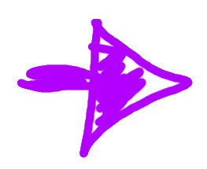
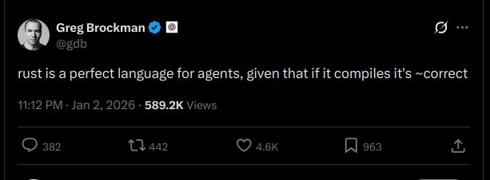

---

# The end of abstraction?

Strawman:

> "Why use libraries, code is free now!"

--

.abspos.top240.left515.arrow.rotate230[]

.abspos.top278.left557.purple.big[True!]

--

.abspos.top248.left294.arrow.rotate230[]

.abspos.top290.left264[]

---

# Not: Fundamentals don't matter

--

## Rather: Fundamentals matter *more*

---

# Agents = naive humans who think they know everything

.center[.p40[]]

.center[
    *"I was so much older then, 
    I'm younger than that now"*
]

---

# What I see

Good libraries and frameworks:

* Encode best practices and collective wisdom
* Steer you to success

---

# What I see

.p80[]

---

# What I see

.p80[]

-->