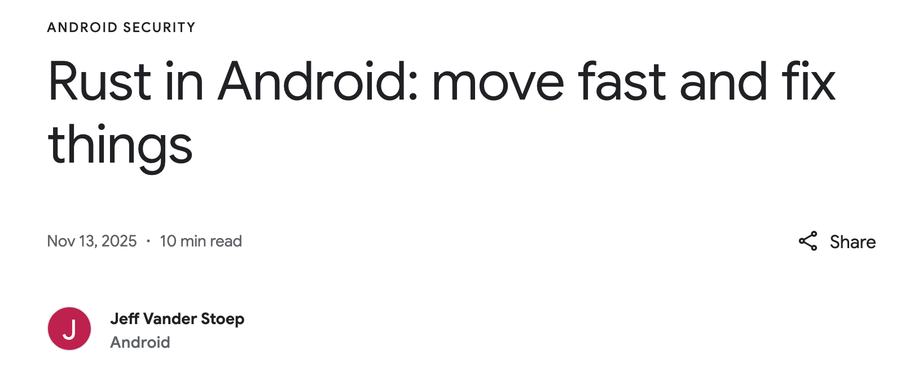
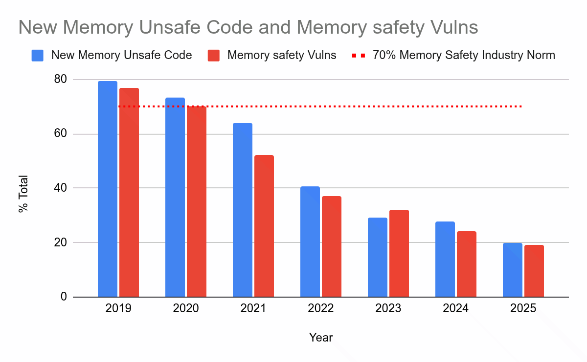
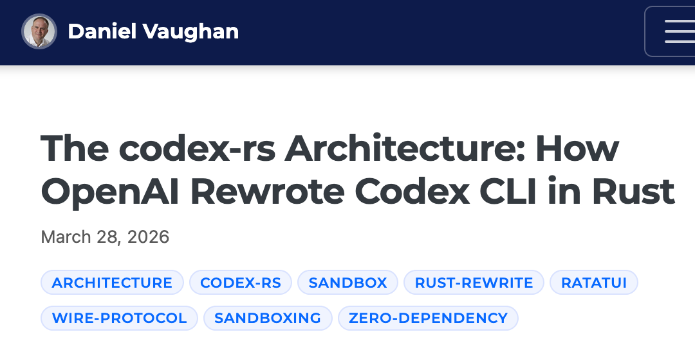
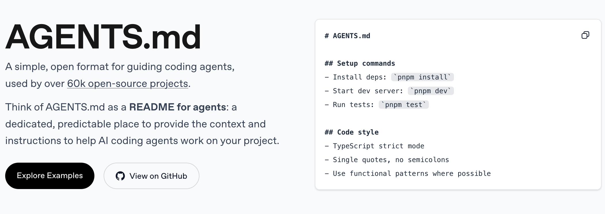
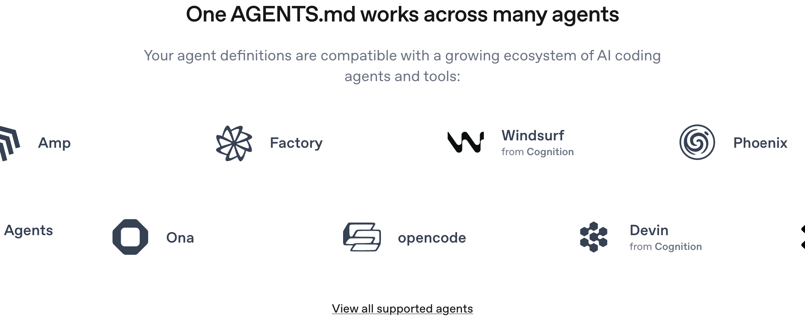

class: center
name: title
count: false

.p60[]

.me[.grey[*by* **Nicholas Matsakis**]]
.left[.citation[View slides at `https://nikomatsakis.github.io/gosim-paris-2026/`]]

---

# What is Symposium?

* Extended Rust toolchain for agentic development

--


* Marquee feature:
    * Installing skills, hooks, etc based on your dependencies

--


* Member of the Rust Foundation's Innovation Lab


---

# Why Symposium?

---

# Who am I?

One of the lead designers of Rust

.center[.p80[]]

---

# Who am I?

Senior Principal Engineer at Amazon

.center[.p80[]]

---

# Not heard of Rust?

.abspos.top25.left519.width300px[]

*Low-level enough for a kernel...*

&nbsp;&nbsp;&nbsp;&nbsp;&nbsp;&nbsp;&nbsp;&nbsp;&nbsp; *usable enough for a GUI*

---

# Rust has been on a roll lately

* Reliable, memory safe

--

.bordered[]

.bordered.abspos.top331.left274.width500px[]

--

.abspos.arrow.top370.left371.rotate135[]

--

.abspos.arrow.top386.left434.rotate135[]

--

.abspos.arrow.top415.left496.rotate135[]

---

# Rust has been on a roll lately

* Reliable, memory safe
* Efficient by default

--

.abspos.top196.left28.width600px.bordered[]

--
.abspos.top304.left150.width600px.bordered[]

--
.abspos.top379.left286.width600px.bordered[]

---

# Rust has been on a roll lately

* Reliable, memory safe
* Efficient by default
* Productive and versatile

--

> When I got to know about it, I was like 'yeah this is the language I've been looking for'. This is the language that will just make me stop thinking about using C and Python. So I just have to use Rust because then **I can go as low as possible as high as possible**.<br>
> <br>
> &mdash; Software engineer and community organizer in Africa

---

# But two main things have been holding us back

* "Rewrites are expensive"

--
* "Learning curve"

---

# But lately... things have been looking a bit different

> My goal is to eliminate every line of C and C++ from Microsoft by 2030. Our strategy is to combine AI *and* Algorithms to **rewrite Microsoft’s largest codebases**. Our North Star is “1 engineer, 1 month, 1 million lines of code”.<br>
> <br>
> &mdash; Distinguished Engineer at Microsoft, [talking about a research project](https://www.linkedin.com/posts/galenh_principal-software-engineer-coreai-microsoft-activity-7407863239289729024-WTzf/) (emphasis mine)

---

# *Really* different

> If you’ve already tried Rust and found the learning curve too steep, give it another try with Claude Code or Codex as your pair programmer. **The experience is different when you have an AI that can navigate ownership and borrowing patterns** while you focus on building things.<br>
> <br>
> The tools finally catching up to the promise of the language.<br>
> <br>
> &mdash; Tigran Bayburtsyan, ["Coding Rust with Claude Code and Codex"](https://tigran.tech/coding-rust-with-claude-code-and-codex/) (emphasis mine)

---

# What is happening?

**With AI, coding is faster,**

---

# What is happening?

**With AI, coding is faster,**

...so nobody will use libraries and we'll just let agents write assembly language for max performance!

--

.abspos.top269.left455[]

---

# What is happening?

**With AI, coding is faster,**

--

...so fundamentals matter **more**, not **less**.

.abspos.top233.left391.width400px[]

---

# Rust + LLM = dream-team?

* Guardrails

--
template:guardrails

.p80[]

.footnote[
    Co-founder and president of OpenAI.
]


---

# Rust + LLM = dream-team?

* Guardrails
* Versatility

--

.abspos.width600px.bordered.top212.left150[]

---

# Rust + LLM = dream-team?

* Guardrails
* Versatility
* Efficiency

--

.abspos.top247.left52.width600px.bordered[]

.abspos.top349.left112.width600px.bordered[]

.abspos.top415.left187.width600px.bordered[]

---

# Rust + LLM = dream-team?

* Guardrails
* Versatility
* Efficiency
* Investment in error messages

--

.center.megamoj[🤔]

---

# Error messages?


--

.abspos.arrow.top183.left260.rotate135[]

.abspos.arrow.top163.left302.textbox.purple[The base error]

--

.abspos.arrow.top353.left298.rotate135[]

.abspos.arrow.top341.left341.textbox.purple[Needed context]

--

.abspos.arrow.top441.left244.rotate135[]

.abspos.arrow.top426.left284.textbox.purple[How to fix]

---

# So... Rust + agents are good

## But could they be better?


---
name:toasty

# Example: Toasty


---
template:toasty
.abspos.arrow.top326.left303.rotate135[]

---
template:toasty

.abspos.arrow.top389.left168.rotate135[]

.abspos.arrow.top491.left175.rotate135[]

.abspos.arrow.top546.left193.rotate135[]

---
name: using-toasty
# Example: Using Toasty


---
template: using-toasty
.abspos.arrow.top143.left237.rotate135[]

.abspos.arrow.top129.left280.textbox.purple[Macros and custom syntax]

---
template: using-toasty

.abspos.arrow.top372.left369.rotate230[]

.abspos.arrow.top425.left352.textbox.purple[New methods]

---

# Toasty is a good example of what is cool about Rust

* **Guardrails:** API enforces type-safety, correct column names, etc
* **Versatility:** High-level and declarative
* **Efficiency:** Compiles to efficient code

.footnote[
    But don't ask about the *Error messages* -- getting good error messages from a macro-heavy library
    like this is a whole 'nother talk!
]
---

# Claude doesn't even know it exists

"What library do you recommend for working with sqlite in Rust?"


.footnote[
    For the record, these too are all excellent libraries!
]

---

# Claude, can you use toasty?


---

# Claude, can you use toasty?


--

.abspos.arrow.top163.left572.textbox.purple[That's a lot of tokens...]

---

# Claude, can you use toasty?


--

.abspos.arrow.top278.left613.rotate110[]

---

# Toasty on crates.io


--

.abspos.arrow.top295.left160.rotate110[]

.abspos.arrow.top295.left160.rotate110[]

---

# The world is moving faster than ever

## Training data can't keep up

--


--

.abspos.arrow.top584.left228.rotate180[]

.abspos.arrow.top591.left280.textbox.purple[Rust 2024 hit stable Feb 2025]

---

# Common failings I see

* Using old versions of crates
* Using old versions of Rust
* Writing GC-like patterns in Rust
    * Claude 💖 mutexes
    * Niko does not

---

# Most frustrating thing of all?

## ...the Rust org cannot help

.center[]
.abspos.arrow.top366.left313.textbox.purple[&nbsp;&nbsp;Anthropic<sup>1</sup>&nbsp;&nbsp;]

.footnote[
    <sup>1</sup> I should say: I tried that toasty example twice, and the second time, Claude did use Toasty 0.5. But it still made a Rust crate in the 2021 edition.
]

---

# Core axiom: Extensibility wins

.center["Everybody has something unique to offer"]

.center[.p60[]]

.abspos.arrow.top518.left305.textbox.purple[*"Release the Rust ecosystem!"*]


---

# ..and this is where Symposium comes in

.center[.p60[]]

---

# Install symposium

```
$ cargo binstall symposium
```

--

```
$ cargo agents init
Setting up symposium for your user account.

Which agents do you use? (space to select, enter to confirm):
> [x] Claude Code
  [ ] Codex CLI
  [ ] GitHub Copilot
  [ ] Gemini CLI
  [ ] Goose
  [x] Kiro
  [x] OpenCode
```

---

# Symposium gives general guidance

* General Rust guidance, e.g.,
    * Use Rust 2024
    * Use `cargo add` to add crates so you get the latest version
    * Run `cargo fmt` after making edits

---

# Symposium syncs skills


--

.abspos.top195.left28.arrow[]

---

# Symposium syncs skills

```
$ ls
Cargo.lock      Cargo.toml      src

$ cargo agents sync
ℹ️  scanning 1 workspace dependencies
🟢 ~/.claude/settings.json: hooks already registered
✅ installed skill find-crate-source → ~/dev/toaster/.claude/skills/find-crate-source
✅ installed skill rust-best-practice → ~/dev/toaster/.claude/skills/rust-best-practice
✅ installed skill toasty-guidance → ~/dev/toaster/.claude/skills/toasty-guidance
🟢 ~/.kiro/agents/symposium.json: hooks already registered
✅ installed skill find-crate-source → ~/dev/toaster/.kiro/skills/find-crate-source
✅ installed skill rust-best-practice → ~/dev/toaster/.kiro/skills/rust-best-practice
✅ installed skill toasty-guidance → ~/dev/toaster/.kiro/skills/toasty-guidance
```

--

.abspos.top176.left236.arrow.rotate135[]


---

# Symposium syncs skills... automatically

* Install hooks:
    * After every tool use, `cargo agents sync` runs automatically
    * When the agent runs `cargo add`, new skills appear

---
name: crate-info
# Symposium provides APIs to help agents

```bash
> cargo agents crate-info serde
Crate: serde
Version: 1.0.228
Source: /Users/nikomat/.cargo/registry/src/index.crates.io-1949cf8c6b5b557f/serde-1.0.228
```

---
template: crate-info

.abspos.arrow.top169.left221.rotate135[]

.abspos.arrow.top150.left265.textbox.purple[Correct version used by your code]

---
template: crate-info

.abspos.arrow.top257.left340.rotate210[]

.abspos.arrow.top308.left373.textbox.purple[Let the agent browse full sources]

---

# Symposium provides for interoperability

As a library author, write one set of extensions that work across agents...

--

...good luck with that.

---

# Even AGENTS.md is not universally supported

.abspos.bordered.width600px[]

--

.abspos.bordered.width600px.top315.left224[]

---

# Niko to vendors...

.abspos.top165.left222[]

---

# Symposium does the best we can

* Library (crate) provides extensions
    * MCP servers
    * Skills
    * Hooks
--


* User picks agent

--


* Symposium adapts
    * Load skills into the right directories for the agent user chose
    * Converts between hook formats

---

# Conclusions

* Rust + LLM = peanut butter + chocolate
--

* Symposium:
    * Bring the collective wisdom of the Rust ecosystem to bear on making your agent code better
--
* Extensibility FTW:
    * Everyone has something unique to offer

--

Use Rust? Try it now!

```
$ cargo binstall symposium
$ cargo agents init
```

.abspos.top353.left459[]