class: center
name: title
count: false

.p60[]

.me[.grey[*by* **Nicholas Matsakis**]]
.left[.citation[View slides at `https://nikomatsakis.github.io/talkrepo/`]]

---

# Who am I?

--

* Rust maintainer since 2011

--

* Co-lead of the Rust language design team

--

* Senior Principal Engineer at Amazon

---

# Not here in that capacity

---

# What is Symposium?

--

Two answers:

--

* A tool to install crates/hooks/etc based on your Rust dependencies

---

# Example

*demo*

*demo*

---

# What is Symposium?

Two answers:

* A tool to install crates/hooks/etc based on your Rust dependencies

--

* A Rust toolchain aimed for use with *agents*

---

# A toolchain aimed at agents?

Simplest example:

```bash
> cargo agents crate-info serde
Crate: serde
Version: 1.0.228
Source: /Users/nikomat/.cargo/registry/src/index.crates.io-1949cf8c6b5b557f/serde-1.0.228
```

---

# So *why* do Symposium?

???

---

# Coding is going agentic

???

It is my belief that agentic techniques are going here to stay.

---

# Rust is a popular choice

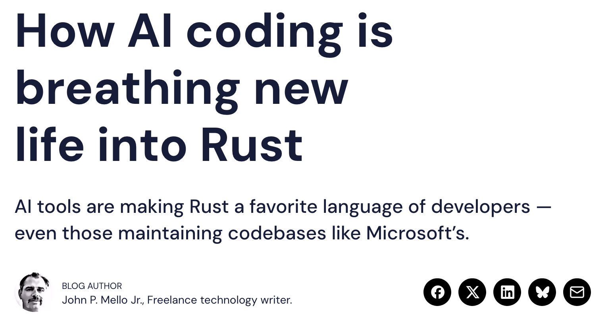

--

.abspos.top282.left497.arrow.rotate230[]

--

.abspos.top321.left544.width300px[]

---

# Ambitious goals

> My goal is to eliminate every line of C and C++ from Microsoft by 2030. Our strategy is to combine AI *and* Algorithms to rewrite Microsoft’s largest codebases. Our North Star is “1 engineer, 1 month, 1 million lines of code”.<br>
> <br>
> &mdash; [Distinguished Engineer at Microsoft, talking about a research project](https://www.linkedin.com/posts/galenh_principal-software-engineer-coreai-microsoft-activity-7407863239289729024-WTzf/)

???

Here is one example that was sent around a lot recently -- but there are many.

---

# Fundamentals matter more now

| Losers | Winners |
| --- | --- |
| Incumbents | Fundamentals |

???


---
name:guardrails

# What makes Rust a good fit?

* Guardrails

---
template:guardrails

> "What I really love about Rust is that if it compiles it usually runs. That is fantastic, and that is something that I'm not used to in Java."<br>
> <br>
> &mdash; Senior software engineer working in automotive embedded systems

---
template:guardrails

.p80[]

.footnote[
    Co-founder and president of OpenAI.
]
---

# What makes Rust a good fit?

* Guardrails
* Versatility

--

> When I got to know about it, I was like 'yeah this is the language I've been looking for'. This is the language that will just make me stop thinking about using C and Python. So I just have to use Rust because then **I can go as low as possible as high as possible**.<br>
> <br>
> &mdash; Software engineer and community organizer in Africa

---

# What makes Rust a good fit?

* Guardrails
* Versatility
* Efficiency

--

.p60.bordered[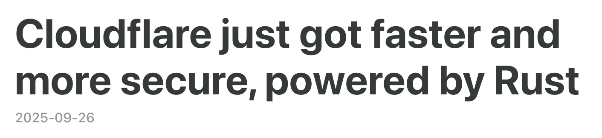]

--
.abspos.top283.left105.p60.bordered[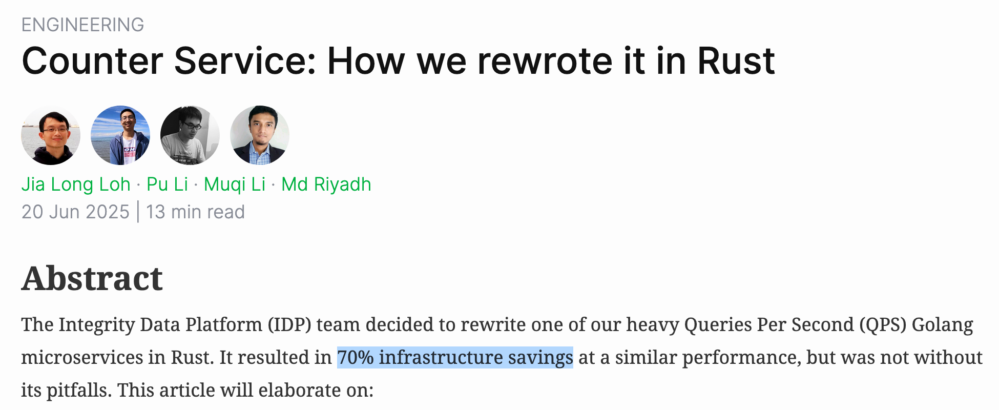]

--
.abspos.top340.left188.p60.bordered[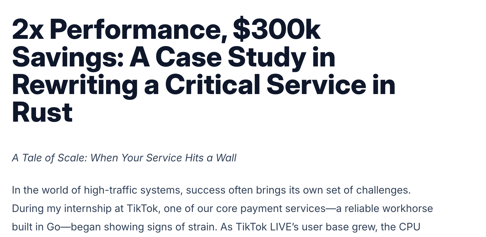]

---

# What makes Rust a good fit?

* Guardrails
* Versatility
* Efficiency
* Investment in error messages

--

.center.megamoj[🤔]

---

# Error messages?

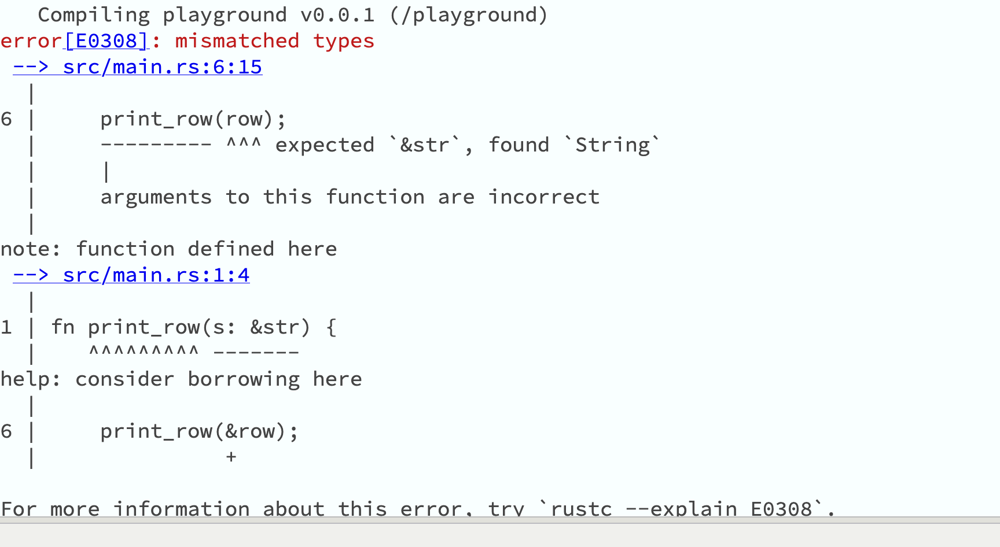

--

.abspos.arrow.top183.left260.rotate135[]

.abspos.arrow.top163.left302.textbox.purple[The base error]

--

.abspos.arrow.top353.left298.rotate135[]

.abspos.arrow.top341.left341.textbox.purple[Needed context]

--

.abspos.arrow.top441.left244.rotate135[]

.abspos.arrow.top426.left284.textbox.purple[How to fix]

---

# So if Rust is so good...

> Claude is pretty great at Rust as is. I'd be interested to hear more about what you've found it's bad at.<br>
> <br>
> &mdash; a friend of mine, making a comment I've heard a lot

---

# Sure, Claude is good

## But could it be better?

---

# Rust is a language of DSLs

> **Clarity of purpose**<br>
> <br>
> Great code brings only the important characteristics of your application to your attention. It avoids wading through needless complexity to express an idea. Great code can be written and understood iteratively, emphasizing different characteristics at different levels of abstraction.

.footnote[
    from Tyler Mandry's blost post *[Rust's design goals should be about code](https://tmandry.gitlab.io/blog/posts/the-main-thing/)*
]

---
name:toasty

# Example: Toasty

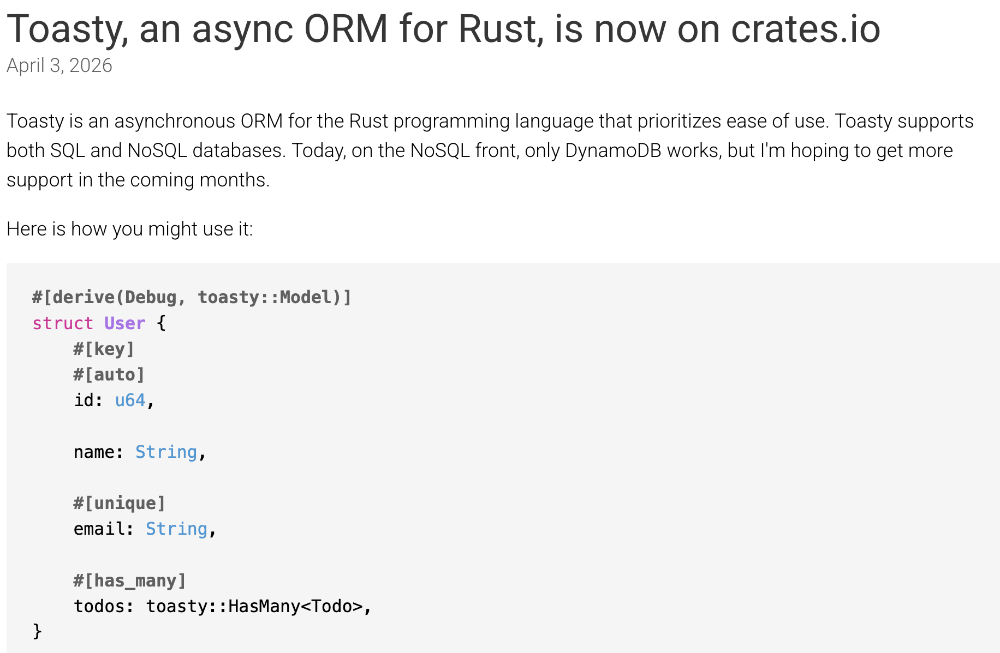

---
template:toasty
.abspos.arrow.top326.left303.rotate135[]

---
template:toasty

.abspos.arrow.top389.left168.rotate135[]

.abspos.arrow.top491.left175.rotate135[]

.abspos.arrow.top546.left193.rotate135[]

---
name: using-toasty
# Example: Using Toasty

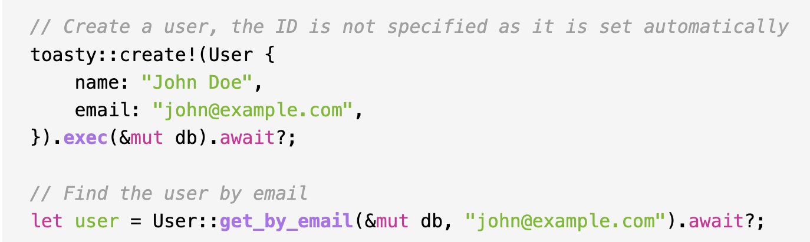

---
template: using-toasty
.abspos.arrow.top143.left237.rotate135[]

.abspos.arrow.top129.left280.textbox.purple[Macros and custom syntax]

---
template: using-toasty

.abspos.arrow.top372.left369.rotate230[]

.abspos.arrow.top425.left352.textbox.purple[New methods]

---

# Toasty is a good example of what is cool about Rust

* **Guardrails:** API enforces type-safety, correct column names, etc
* **Versatility:** High-level and declarative
* **Efficiency:** Compiles to efficient code

.footnote[
    But don't ask about the *Error messages* -- getting good error messages from a macro-heavy library
    like this is a whole 'nother talk!
]
---

# Claude doesn't even know it exists

"What library do you recommend for working with sqlite in Rust?"

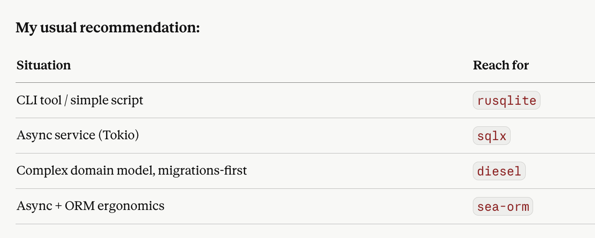

.footnote[
    For the record, these too are all excellent libraries!
]

---

# Claude, can you use toasty?

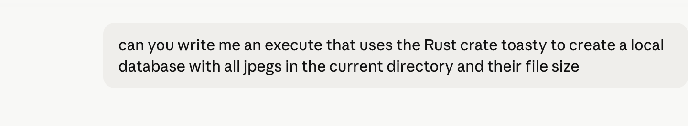

---

# Claude, can you use toasty?

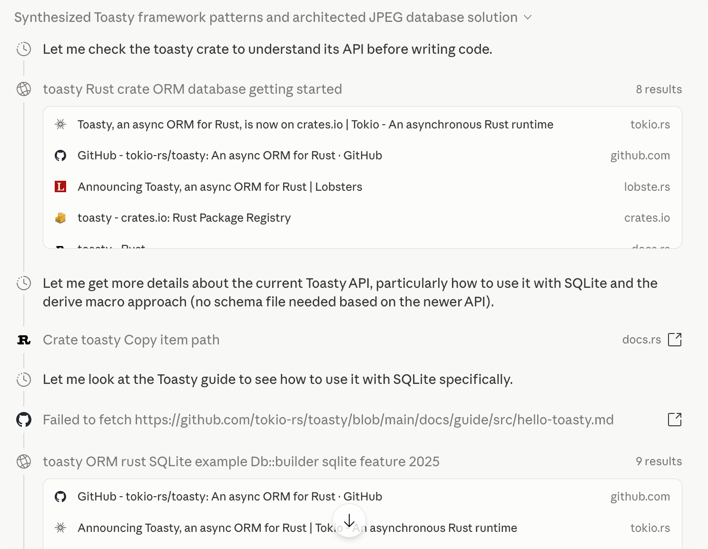

---

# Claude, can you use toasty?

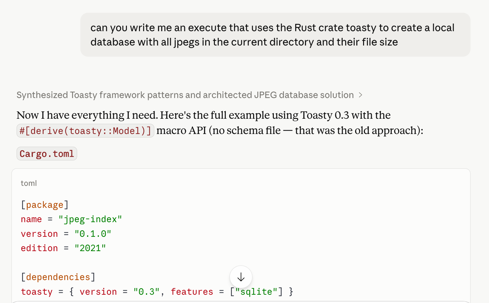

--

.abspos.arrow.top278.left613.rotate110[]

---

# Toasty on crates.io

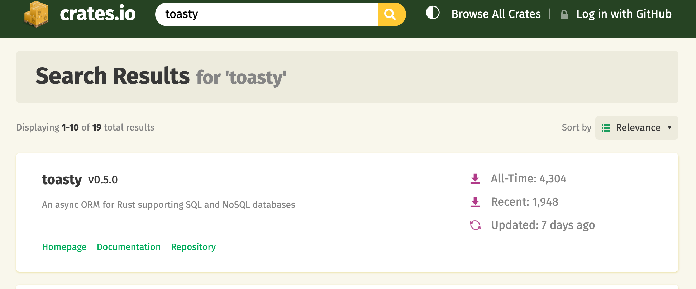

--

.abspos.arrow.top295.left160.rotate110[]

.abspos.arrow.top295.left160.rotate110[]

---

# The world is moving faster than ever

## Training data can't keep up

--


--

.abspos.arrow.top584.left228.rotate180[]

.abspos.arrow.top591.left280.textbox.purple[Rust 2024 hit stable Feb 2025]

---

# Common failings I see

* Using old versions of crates
* Using old versions of Rust
* Writing GC-like patterns in Rust (Claude 💖 mutexes)

---

# Most frustrating thing of all?

## ...the Rust org cannot help

.center[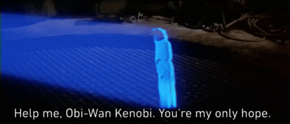]
.abspos.arrow.top366.left313.textbox.purple[&nbsp;&nbsp;Anthropic<sup>1</sup>&nbsp;&nbsp;]

.footnote[
    <sup>1</sup> I should say: I tried that toasty example twice, and the second time, Claude did use Toasty 0.5.<br>But it still made a Rust crate in the 2021 edition.
]

---

# Niko to AI vendors

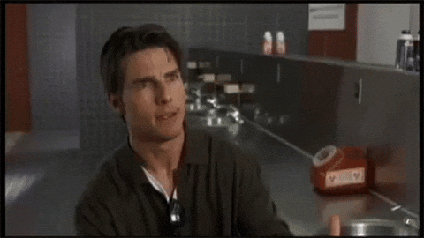

---

# ..and this is where Symposium comes in

.center[.p60[]]

---

# ..and this is where Symposium comes in

.center[.p60[]]

---

# Install symposium

```
$ cargo agents init
Setting up symposium for your user account.

Which agents do you use? (space to select, enter to confirm):
> [x] Claude Code
  [ ] Codex CLI
  [ ] GitHub Copilot
  [ ] Gemini CLI
  [ ] Goose
  [x] Kiro
  [x] OpenCode
```

---

# Symposium gives general guidance

* General Rust guidance, e.g.,
    * Use Rust 2024
    * Use `cargo add` to add crates so you get the latest version
    * Run `cargo fmt` after making edits

---

# Symposium syncs skills

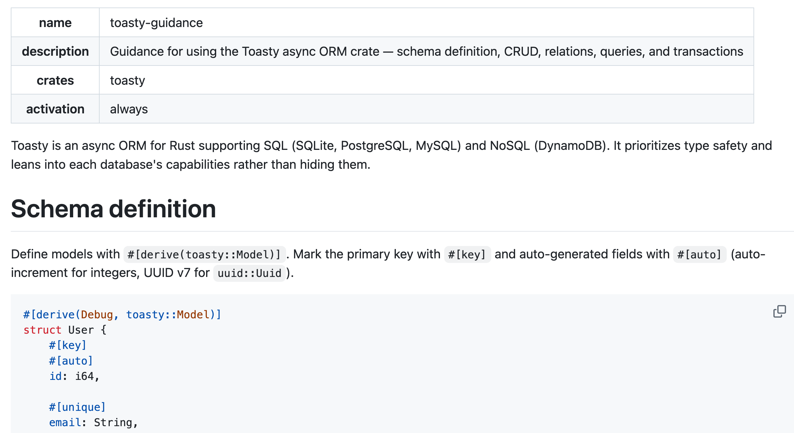

--

.abspos.top195.left28.arrow[]

---

# Symposium syncs skills

```
$ ls
Cargo.lock      Cargo.toml      src

$ cargo agents sync
ℹ️  scanning 1 workspace dependencies
🟢 ~/.claude/settings.json: hooks already registered
✅ installed skill find-crate-source → ~/dev/toaster/.claude/skills/find-crate-source
✅ installed skill rust-best-practice → ~/dev/toaster/.claude/skills/rust-best-practice
✅ installed skill toasty-guidance → ~/dev/toaster/.claude/skills/toasty-guidance
🟢 ~/.kiro/agents/symposium.json: hooks already registered
✅ installed skill find-crate-source → ~/dev/toaster/.kiro/skills/find-crate-source
✅ installed skill rust-best-practice → ~/dev/toaster/.kiro/skills/rust-best-practice
✅ installed skill toasty-guidance → ~/dev/toaster/.kiro/skills/toasty-guidance
```

---

# Symposium syncs skills... automatically

* General Rust guidance, e.g.,
    * Use Rust 2024
    * Use `cargo add` to add crates so you get the latest version
    * Run `cargo fmt` after making edits

--

* Install hooks:
    * After every tool use, synchronize skills
    * When the agent runs `cargo add`, new skills appear

---

# Why Symposium, Part 2

## Agent accessibility

---

# Good error messages are *agent accessible*


.abspos.arrow.top183.left260.rotate135[]

.abspos.arrow.top163.left302.textbox.purple[The base error]

.abspos.arrow.top353.left298.rotate135[]

.abspos.arrow.top341.left341.textbox.purple[Needed context]

.abspos.arrow.top441.left244.rotate135[]

.abspos.arrow.top426.left284.textbox.purple[How to fix]

---

# Good error messages are *not enough*

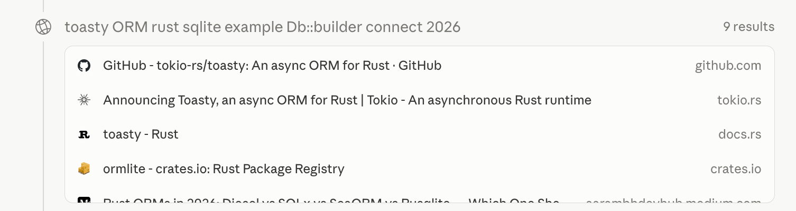

--

.abspos.arrow.top234.left818.rotate135[]

---

# Good for humans...

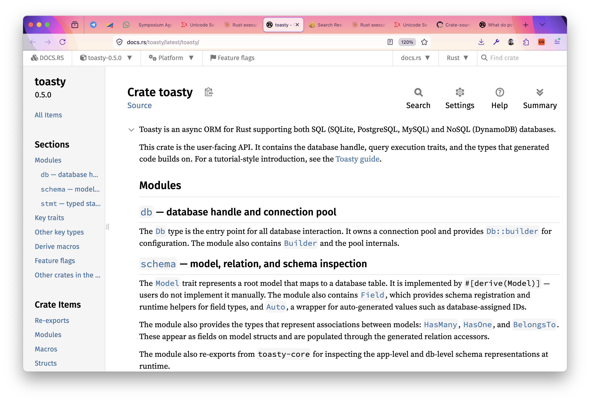

---

# ...isn't always good for agents

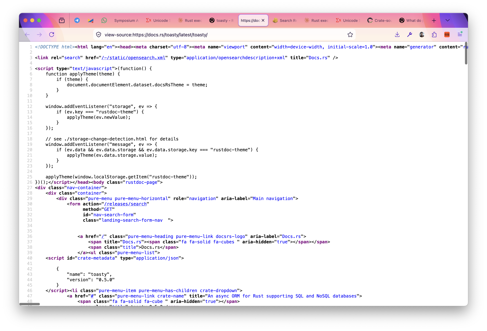

---

# Comparison: go doc

```
> go doc http
package http // import "net/http"

Package http provides HTTP client and server implementations.

Get, Head, Post, and PostForm make HTTP (or HTTPS) requests:

    resp, err := http.Get("http://example.com/")
    ...
    resp, err := http.Post("http://example.com/upload", "image/jpeg", &buf)
    ...
    resp, err := http.PostForm("http://example.com/form",
        url.Values{"key": {"Value"}, "id": {"123"}})

The caller must close the response body when finished with it:
```

---
name: crate-info

# Symposium: crate-info

```bash
> cargo agents crate-info serde
Crate: serde
Version: 1.0.228
Source: /Users/nikomat/.cargo/registry/src/index.crates.io-1949cf8c6b5b557f/serde-1.0.228
```

---
template: crate-info

.abspos.arrow.top169.left221.rotate135[]

.abspos.arrow.top150.left265.textbox.purple[Correct version used by your crate]

---
template: crate-info

.abspos.arrow.top257.left340.rotate210[]

.abspos.arrow.top308.left373.textbox.purple[Source is already cached by cargo]

---
name: errors-critique
# Looking again at error messages


---

template: errors-critique

.abspos.arrow.top259.left252.rotate220[]

.abspos.arrow.top296.left298.textbox.purple[ASCII art... hmm. Are agents good at matching columns?]

---

template: errors-critique

.abspos.arrow.top498.left238.rotate220[]

.abspos.arrow.top538.left286.textbox.purple[Should we target Rust learners?]

---

template: errors-critique

.abspos.arrow.top101.left483.rotate130[]

.abspos.arrow.top68.left468.textbox.purple[Overall: a lot of tokens]

---

# RTK: Rust token killer

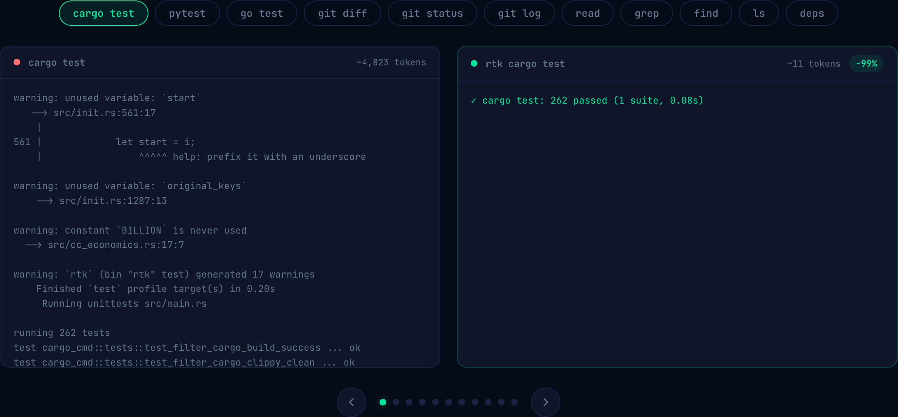

--

.abspos.arrow.top158.left394.rotate130[]
.abspos.arrow.top129.left432.textbox.purple[4823 tokens]

--

.abspos.arrow.top201.left780.rotate290[]
.abspos.arrow.top260.left687.textbox.purple[11 tokens]

---

# Symposium 

* General Rust guidance
* Per-crate skills, MCP servers, etc

--
* Agent-accessible toolchain
    * crate-info
    * rtk
    * more to come!
--
* **Connects you to the best** (e.g., RTK)

---

# Symposium: Extensibility